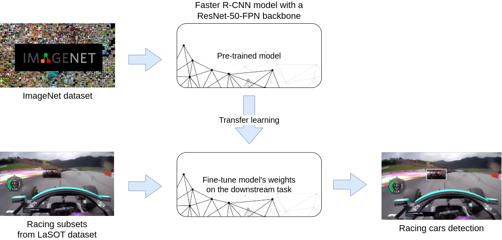

# F1 racing cars tracking through transfer learning



In this project we make use of transfer learning ([Pan and Yang, 2009](https://ieeexplore.ieee.org/document/5288526)), by fine-tuning a pre-trained faster R-CNN model
with a ResNet-50-FPN backbone ([Ren et al., 2015](https://arxiv.org/abs/1506.01497)), to develop a pipeline for detection and tracking of F1 racing cars, enhanced with histograms distance.

For further information, you can read the [presentation slides](presentation.pdf).

This project has been developed during the A.Y. 2021-2022 for the [Computer Vision](https://visionlab.di.uniroma1.it/computer-vision/) course @ Sapienza University of Rome.

## Dependencies
Install all the python dependencies:
```bash
pip install -r requirements.txt
```

## Authors

- [Andrea Gasparini](https://github.com/andrea-gasparini)
- [Edoardo Di Paolo](https://github.com/aedoardo)
